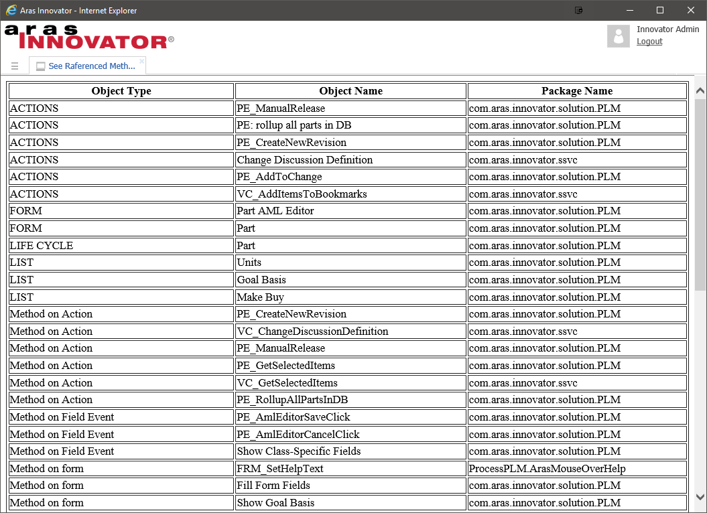

# ARAS EXPORT LIST

Aim of this project is to make the utility that gives the details of all objects which are attached to an Item type.

## Project Details

#### Built Using:
Aras 9.4 

#### Versions Tested:
Aras 9.4, Aras 11.0 SP9

#### Browsers Tested:
Internet Explorer 11, Firefox 38 ESR, Chrome

## How It Works

It passes the Item id to a method which queries the ItemType's related items and builds the html report of result.

## Installation

#### Important!
**Always back up your code tree and database before applying an import package or code tree patch!**

### Pre-requisites

1. Aras Innovator installed

### Install Steps

1. Backup your code tree and store the backup in a safe place.
2. Copy the Innovator folder from the project's CodeTree subdirectory.
3. Paste the Innovator folder into the root directory of your Aras installation.
    * Tip: This is the same directory that contains the InnovatorServerConfig.xml file.
4. Backup your database and store the BAK file in a safe place.
5. Import the package using Super user login.
6. Restart IIS.

## How it works

1. Login to ARAS innovator.
2. Search the Item type from TOC panel.
3. Right Click on Item and click on the Reference report.
 

## What does it do for you?

Export List utility gives you the list of objects along with packaging details listed below.

*	ACTION
*	EMAIL MESSAGE USED ON WORKFLOW.
*	FORM
*	LIST
*	LIFE CYCLE
*	METHOD
*	PERMISSION
*	PERMISSION USED ON LIFE CYCLE STATES
*	RELATIONSHIP TYPE
*	RELATIONSHIP TYPE GRID
*	RELATIONSHIPTYPE VIEW FORM
*	REPORT
*	SEQUENCE
*	WORKLFLOW
	
For methods it covers references listed below.
	
* Activity Server Events on Workflow.
* Client Events.
* Field Events on Form.
* Grid Events of Property.
* Grid Events on Relationship Type for Specified Grid
* Lifecycle Post-Transition.
* Lifecycle Pre-Transition.
* Server Events.
* Workflow Post-Path.
* Workflow Pre-Path.
* Methods on Action.
* Methods on Form.
* Methods on Relationship type.
* Methods on Report.
		
## Credits

Project Owner: Sagar Makhesana

Created On: May 10-2017
